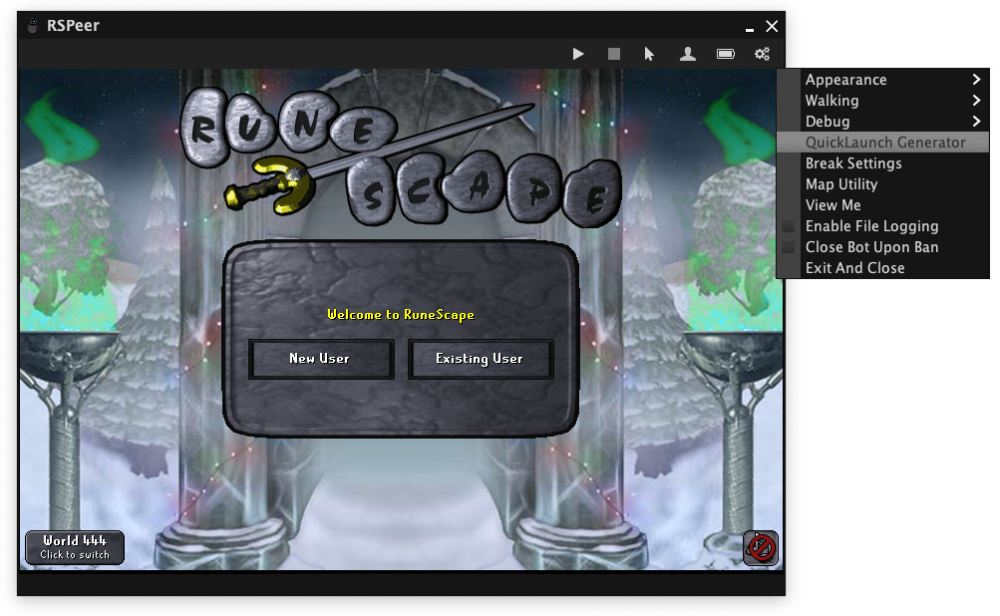
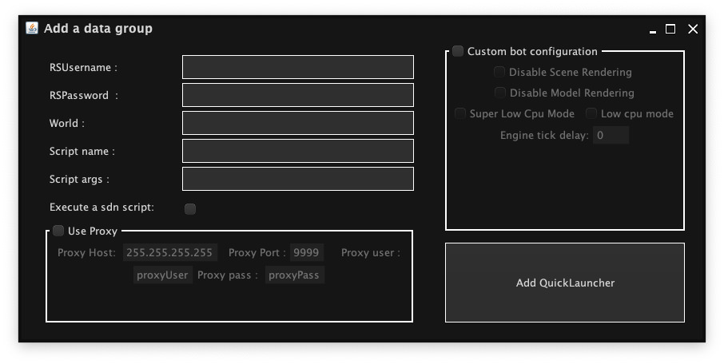

RSPeer's *Quick Launch* feature allows users to start the client with a
preconfigured Runescape account, proxy, and script without any user interaction.
Using this feature, users are able to spawn clients through the Bot Management
interface, developers are able to quickly test their scripts without manually
activating them, and large-scale deployments are able to run in a completely
automated fashion.

## Basic Usage

The easiest way to generate a configuration is through the QuickLaunch
Generator, which can be accessed through the settings menu:



Through this interace you can specify various startup options:



Saving these options will create or update `cache/LauncherQuickLaunch.json` and
create `cache/quicklaunch/<RsUsername>(<ScriptName>).json` in your RSPeer
directory, found at the following locations:

- **Windows:** `%USERPROFILE%\My Documents\RSPeer` (e.g.,
  `C:\Users\YourName\My Documents\RsPeer`)
- **macOS/Linux:** `~/RSPeer` (e.g., `/home/YourName/RSPeer` or
  `/Users/YourName/RSPeer`)

`LauncherQuickLaunch.json` can be copied to your botting server(s) and used
by running:

```
java -jar path/to/rspeer-launcher.jar path/to/LauncherQuickLaunch.json
```

Alternatively, you can upload this file somewhere and load it with its URL:

```
java -jar path/to/rspeer-launcher.jar https://example.com/LauncherQuickLaunch.json
```

Be absolutely certain this URL is only accessible to *you*! Additionally, you
will still be required to enter your RSPeer email and password on the first run
unless you've added them to your config. For example:

```json
{
	"RspeerEmail": "maddev@rspeer.org",
	"RspeerPassword": "FAKE_PASS",
	"AutoUpdateClient": true,
	"Clients": [{
		"RsUsername": "MadDev123",
		"RsPassword": "rips",
		"World": 82,
		"ScriptName": "Manly Chopper",
		"IsRepoScript": true,
		"ScriptArgs": "-tree yew",
		"UseProxy": false,
		"ProxyPort": 80,
		"ProxyIp": "",
		"ProxyUser": "MadDev",
		"ProxyPass": "FakePass",
		"Config": {
			"LowCpuMode": true,
			"SuperLowCpuMode": true,
			"EngineTickDelay": 0,
			"DisableModelRendering": false,
			"DisableSceneRendering": false
		}
	}]
}
```

See the [Reference](#reference) for more details about the available options.

## Command-Line Usage

This next section is only relevant to the RSPeer client. See
[this thread][launcher-docs] for information about the launcher.

[launcher-docs]: https://discourse.rspeer.org/t/how-to-use-quick-start-arguments-with-the-launcher/2323

Using the config made in [Basic Usage](#basic-usage), it's possible to start the
RSPeer client directly with:

```json
java -jar path/to/rspeer-client.jar -qs path/to/YourPlayer(YourScript).json
```

Like before, you can also serve these files via HTTP:

```json
java -jar path/to/rspeer-client.jar -qs https://example.com/client-config.json
```

**Note:** Starting the client directly means you will be solely responsible for
downloading client updates. If automatic updates is something you need and you
don't want to implement your own custom launcher, stick to using the official
RSPeer launchers instead.

### Passing a Config as an Argument

The last method for starting RSPeer automatically is by [Base64][base64]
encoding your configuration and passing it on the command-line. This is
especially useful if you've chosen to dynamically generate your config and don't
want to save it to disk or serve it over HTTP. For example:

```
java -jar path/to/rspeer-client.jar -qs 'ewogICJSc1VzZXJuYW1lIjogInVzZXJAZXhhbXBsZS5jb20iLAogICJSc1Bhc3N3b3JkIjogInBAc3N3MHJkISIsCiAgIldvcmxkIjogMTMzNywKICAiU2NyaXB0TmFtZSI6ICJDb29sIFNjcmlwdCIsCiAgIklzUmVwb1NjcmlwdCI6IHRydWUsCiAgIlNjcmlwdEFyZ3MiOiAiIiwKICAiVXNlUHJveHkiOiB0cnVlLAogICJQcm94eVBvcnQiOiAiODA4MCIsCiAgIlByb3h5SXAiOiAiMTI3LjAuMC4xIiwKICAiUHJveHlVc2VyIjogIiIsCiAgIlByb3h5UGFzcyI6ICIiLAogICJDb25maWciOiB7CiAgICAiTG93Q3B1TW9kZSI6IGZhbHNlLAogICAgIlN1cGVyTG93Q3B1TW9kZSI6IGZhbHNlLAogICAgIkRpc2FibGVNb2RlbFJlbmRlcmluZyI6IGZhbHNlLAogICAgIkRpc2FibGVTY2VuZVJlbmRlcmluZyI6IGZhbHNlCiAgfQp9Cg=='
```

The long string of gibberish that follows the `-qs` flag is the Base64-encoded
configuration. *nix and WSL users can decode this with the following command:

```
base64 -d <<< 'ewogICJSc1VzZXJuYW1lIjogInVzZXJAZXhhbXBsZS5jb20iLAogICJSc1Bhc3N3b3JkIjogInBAc3N3MHJkISIsCiAgIldvcmxkIjogMTMzNywKICAiU2NyaXB0TmFtZSI6ICJDb29sIFNjcmlwdCIsCiAgIklzUmVwb1NjcmlwdCI6IHRydWUsCiAgIlNjcmlwdEFyZ3MiOiAiIiwKICAiVXNlUHJveHkiOiB0cnVlLAogICJQcm94eVBvcnQiOiAiODA4MCIsCiAgIlByb3h5SXAiOiAiMTI3LjAuMC4xIiwKICAiUHJveHlVc2VyIjogIiIsCiAgIlByb3h5UGFzcyI6ICIiLAogICJDb25maWciOiB7CiAgICAiTG93Q3B1TW9kZSI6IGZhbHNlLAogICAgIlN1cGVyTG93Q3B1TW9kZSI6IGZhbHNlLAogICAgIkRpc2FibGVNb2RlbFJlbmRlcmluZyI6IGZhbHNlLAogICAgIkRpc2FibGVTY2VuZVJlbmRlcmluZyI6IGZhbHNlCiAgfQp9Cg=='
```

There are also [tools](http://www.utilities-online.info/base64/) available
online for handling Base64. You should have the following result:

```json
{
	"RsUsername": "user@example.com",
	"RsPassword": "p@ssw0rd!",
	"World": 1337,
	"ScriptName": "Cool Script",
	"IsRepoScript": true,
	"ScriptArgs": "",
	"UseProxy": true,
	"ProxyPort": "8080",
	"ProxyIp": "127.0.0.1",
	"ProxyUser": "",
	"ProxyPass": "",
	"Config": {
		"LowCpuMode": false,
		"SuperLowCpuMode": false,
		"DisableModelRendering": false,
		"DisableSceneRendering": false
	}
}
```

[base64]: https://en.wikipedia.org/wiki/Base64

## Reference

### Launcher Settings

| **Name** | **Type** | **Description** |
| -------- | -------- | --------------- |
| `RspeerEmail` | *string* | Your RSPeer account email. |
| `RspeerPassword` | *string* | Your RSPeer account password. |
| `AutoUpdateClient` | *boolean* | `true` to automatically update RSPeer, `false` otherwise. |
| `Clients` | *object[]* | Client configurations, see [Client Settings](#client-settings) below. |

### Client Settings

| **Name** | **Type** | **Description** |
| -------- | -------- | --------------- |
| `RsUsername` | *string* | Login name or email of the Runescape account. |
| `RsPassword` | *string* | Login password of the Runescape account. |
| `World` | *integer* | World to join (use `-1` or `null` to pick any world). |
| `ScriptName` | *string* | Name of the script to start. |
| `IsRepoScript` | *boolean* | `true` if the script should be executed from the SDN, `false` if it's available locally. |
| `ScriptArgs` | *string* | Custom arguments to pass to the script on startup. |
| `UseProxy` | *boolean* | `true` to connect via proxy. |
| `ProxyIp` | *string* | IP address of the proxy. |
| `ProxyPort` | *string* | Port of the proxy. |
| `ProxyUser` | *string* | Username for proxy authentication. |
| `ProxyPass` | *string* | Password for proxy authentication. |
| `Config` | *object* | Additional client configuration, see [Config](#config) below. |

### Config

| **Name** | **Type** | **Description** |
| -------- | -------- | --------------- |
| `LowCpuMode` | *boolean* | `true` to enable low CPU mode. |
| `SuperLowCpuMode` | *boolean* | `true` to enable *super* low CPU mode. |
| `EngineTickDelay` | *integer* | Set a delay between game engine ticks for lower CPU, `SuperLowCpuMode` sets this to `50` (recommended `0`-`50`). |
| `DisableModelRendering` | *boolean* | `true` to disable rendering of models for lower CPU and RAM (`LowCpuMode` does this automatically). |
| `DisableSceneRendering` | *boolean* | `true` to disable rendering of scenes for lower CPU and RAM (`LowCpuMode` does this automatically). |

## Troubleshooting

If you find that you're having problems getting the client to run with your
desired configuration, be sure to double-check your settings with the
[available options](#reference) and [check your config][check-config] for
syntax errors.

[check-config]: https://jsonlint.com/
